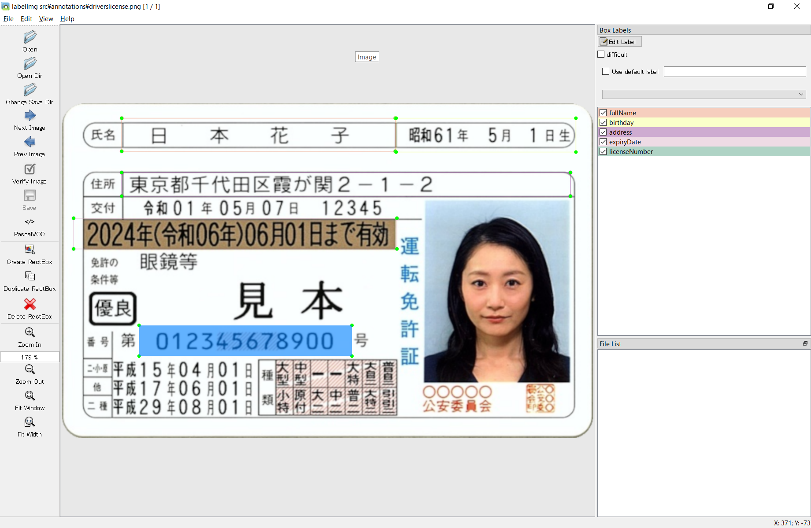

# How to use the template
The template is created using the annotation tool [labelImg](https://github.com/heartexlabs/labelImg).

Annotation is the addition of some information to data.  

In this case, it means to label the area enclosed by the frame.  
The result of annotating with labelImg is saved as an xml file.

# Install labelImg
```sh
pip3 install labelImg
```

# Usage
Created annotations for driver's licenses.
```sh
labelImg .\src\annotations\driverslicense.png
```
